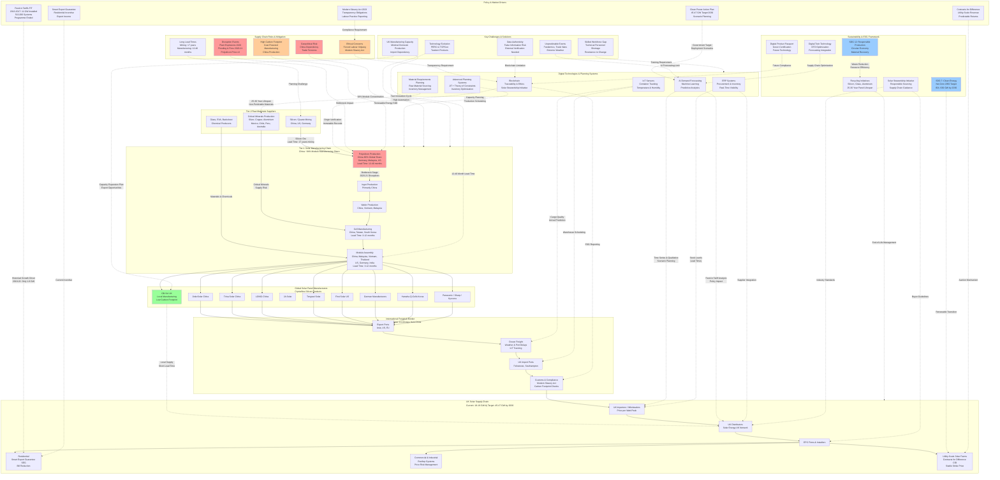

```mermaid
flowchart TD

%% ==========================================================
%% TIER-2 RAW MATERIAL SUPPLY
%% ==========================================================
subgraph RM[Tier-2 Raw Materials Suppliers]
MIN1[Silicon / Quartz Mining<br/>China, US, Germany]
MIN2[Critical Minerals Production<br/>Silver, Copper, Aluminium<br/>Mexico, Chile, Peru, Australia]
MIN3[Glass, EVA, Backsheet<br/>Chemical Producers]
end

%% ==========================================================
%% TIER-1 MANUFACTURING & PROCESSING
%% ==========================================================
subgraph MFG[Tier-1 Solar Manufacturing Chain<br/>China ~94% Module Manufacturing Share]
POLY[Polysilicon Production<br/>China 80% Global Share<br/>Germany, Malaysia, US<br/>Lead Time: 12-40 months]
ING[Ingot Production<br/>Primarily China]
WAF[Wafer Production<br/>China, Vietnam, Malaysia]
CELLS[Cell Manufacturing<br/>China, Taiwan, South Korea<br/>Lead Time: 3-12 months]
MODS[Module Assembly<br/>China, Malaysia, Vietnam, Thailand<br/>US, Germany, India<br/>Lead Time: 3-12 months]
end

MIN1 -->|Silicon Ore<br/>Lead Time: 17 years mining| POLY
MIN2 -->|Critical Minerals<br/>Supply Risk| CELLS
MIN3 -->|Materials & Chemicals| MODS
POLY -->|Bottleneck Stage<br/>2020-21 Disruptions| ING
ING --> WAF
WAF --> CELLS
CELLS --> MODS

%% ==========================================================
%% GLOBAL OEMs / BRANDS SUPPLYING THE UK
%% ==========================================================
subgraph OEMs[Global Solar Panel Manufacturers<br/>Crystalline-Silicon Products]
direction LR
CH1[JinkoSolar China]
CH2[Trina Solar China]
CH3[LONGi China]
CH4[Tongwei Solar]
CH5[JA Solar]
US1[First Solar US]
EU1[German Manufacturers]
KR1[Hanwha Q-Cells Korea]
JP1[Panasonic / Sharp / Kyocera]
UKMAN[GB-Sol UK<br/>Local Manufacturing<br/>Low Carbon Footprint]
end

MODS --> CH1
MODS --> CH2
MODS --> CH3
MODS --> CH4
MODS --> US1
MODS --> EU1
MODS --> KR1
MODS --> JP1
MODS --> UKMAN

%% ==========================================================
%% INTERNATIONAL LOGISTICS TO THE UK
%% ==========================================================
subgraph INTL[International Freight & Border<br/>Transit Time: 14-40 days from China]
EXP[Export Ports<br/>Asia, US, EU]
SHIP[Ocean Freight<br/>Weather & Port Delays<br/>IoT Tracking]
UKPORT[UK Import Ports<br/>Felixstowe, Southampton]
CUST[Customs & Compliance<br/>Modern Slavery Act<br/>Carbon Footprint Checks]
end

CH1 --> EXP
CH2 --> EXP
CH3 --> EXP
CH4 --> EXP
US1 --> EXP
EU1 --> EXP
KR1 --> EXP
JP1 --> EXP
UKMAN -.->|Local Supply<br/>Short Lead Time| DIST
EXP --> SHIP
SHIP --> UKPORT
UKPORT --> CUST

%% ==========================================================
%% UK MARKET SUPPLY CHAIN
%% ==========================================================
subgraph UKSCM[UK Solar Supply Chain<br/>Current: 18-19 GW &#124; Target: 45-47 GW by 2030]
IMP[UK Importers / Wholesalers<br/>Price per Watt-Peak]
DIST[UK Distributors<br/>Solar Energy UK Network]
EPC[EPC Firms & Installers]
RES[Residential<br/>Smart Export Guarantee SEG<br/>Bill Reduction]
COM[Commercial & Industrial<br/>Rooftop Systems<br/>Price Risk Management]
UTI[Utility-Scale Solar Farms<br/>Contracts for Difference CfD<br/>Stable Strike Price]
end

CUST --> IMP
IMP --> DIST
DIST --> EPC
EPC --> RES
EPC --> COM
EPC --> UTI

%% ==========================================================
%% DIGITAL & PLANNING LAYER
%% ==========================================================
subgraph TECH[Digital Technologies & Planning Systems]
AI[AI Demand Forecasting<br/>Machine Learning<br/>Predictive Analytics]
ERP[ERP Systems<br/>Procurement & Inventory<br/>Real-Time Visibility]
BLOCK[Blockchain<br/>Traceability & Ethics<br/>Solar Stewardship Initiative]
IOT[IoT Sensors<br/>Container Tracking<br/>Temperature & Humidity]
APS[Advanced Planning Systems<br/>JIT + Theory of Constraints<br/>Inventory Optimization]
MRP[Material Requirements Planning<br/>Raw Material Sourcing<br/>Inventory Management]
end

AI -.->|Time Series & Qualitative<br/>Scenario Planning| IMP
AI -.->|Feed-in Tariff Analysis<br/>Policy Impact| DIST
ERP -.->|Stock Levels<br/>Lead Times| IMP
ERP -.->|Supplier Integration| DIST
BLOCK -.->|Origin Verification<br/>Immutable Records| POLY
BLOCK -.->|ESG Reporting| CUST
IOT -.->|Cargo Quality<br/>Arrival Prediction| SHIP
IOT -.->|Warehouse Scheduling| UKPORT
APS -.->|Capacity Planning<br/>Production Scheduling| MFG
MRP -.->|25-30 Year Lifespan<br/>Non-Perishable Materials| MIN2

%% ==========================================================
%% RISK MANAGEMENT
%% ==========================================================
subgraph RISK[Supply Chain Risks & Mitigation]
GEOP[Geopolitical Risk<br/>China Dependency<br/>Trade Tensions]
DISRUPT[Disruption Events<br/>Plant Explosions 2020<br/>Flooding & Fires 2020-21<br/>Polysilicon Price x3]
LEAD[Long Lead Times<br/>Mining: 17 years<br/>Manufacturing: 12-40 months]
ETHICS[Ethical Concerns<br/>Forced Labour Xinjiang<br/>Modern Slavery Act]
CARBON[High Carbon Footprint<br/>Coal-Powered Manufacturing<br/>China Production]
end

GEOP -.->|94% Module Concentration| MFG
DISRUPT -.->|Bottleneck Impact| POLY
LEAD -.->|Planning Challenge| MIN1
ETHICS -.->|Transparency Requirement| BLOCK
CARBON -.->|Renewable Energy Shift| POLY

%% ==========================================================
%% SUSTAINABILITY & SDGs
%% ==========================================================
subgraph SUS[Sustainability & ESG Framework]
SDG7[SDG 7: Clean Energy<br/>Net Zero 2050 Target<br/>IEA: 630 GW by 2030]
SDG12[SDG 12: Responsible Production<br/>Circular Economy<br/>Material Recovery]
REC[Recycling Initiatives<br/>Silicon, Glass, Aluminium<br/>25-30 Year Panel Lifespan]
SSI[Solar Stewardship Initiative<br/>Responsible Sourcing<br/>Supply Chain Guidance]
DPP[Digital Product Passport<br/>Green Certification<br/>Future Technology]
TWIN[Digital Twin Technology<br/>OTD Optimization<br/>Forecasting Integration]
end

SDG7 -.->|Renewable Transition| UTI
SDG12 -.->|Waste Reduction<br/>Resource Efficiency| REC
REC -.->|End-of-Life Management| UKSCM
SSI -.->|Industry Standards| DIST
SSI -.->|Buyer Guidelines| EPC
DPP -.->|Future Compliance| BLOCK
TWIN -.->|Supply Chain Optimization| AI

%% ==========================================================
%% POLICY & DEMAND DRIVERS
%% ==========================================================
subgraph POL[Policy & Market Drivers]
FIT[Feed-in Tariffs FiT<br/>2013-2017: 11 GW Installed<br/>513,000 Systems<br/>Programme Ended]
SEG[Smart Export Guarantee<br/>Residential Incentive<br/>Export Income]
CFD[Contracts for Difference<br/>Utility-Scale Revenue<br/>Predictable Returns]
CPAP[Clean Power Action Plan<br/>45-47 GW Target 2030<br/>Scenario Planning]
MSA[Modern Slavery Act 2023<br/>Transparency Obligations<br/>Labour Practice Reporting]
end

FIT -.->|Historical Growth Driver<br/>2018-22: Only 1.8 GW| RES
SEG -.->|Current Incentive| RES
CFD -.->|Auction Mechanism| UTI
CPAP -.->|Government Target<br/>Deployment Scenarios| AI
MSA -.->|Compliance Requirement| ETHICS

%% ==========================================================
%% CHALLENGES & FUTURE DIRECTIONS
%% ==========================================================
subgraph CHAL[Key Challenges & Solutions]
SKIL[Skilled Workforce Gap<br/>Technical Personnel Shortage<br/>Resistance to Change]
CAP[UK Manufacturing Capacity<br/>Minimal Domestic Production<br/>Import Dependency]
TECH2[Technology Evolution<br/>PERC to TOPCon<br/>Tandem Products]
DATA[Data Authenticity<br/>False Information Risk<br/>External Verification Needed]
UNPRED[Unpredictable Events<br/>Pandemics, Trade Wars<br/>Extreme Weather]
end

SKIL -.->|Training Requirement| TECH
CAP -.->|Capacity Expansion Plan<br/>Export Opportunities| UKMAN
CAP -.->|12-40 Month Lead Time| MODS
TECH2 -.->|Fast Innovation Cycle<br/>High Automation| MFG
DATA -.->|Blockchain Limitation| BLOCK
UNPRED -.->|AI Forecasting Limit| AI

style POLY fill:#ff9999
style ETHICS fill:#ffcc99
style CARBON fill:#ffcc99
style GEOP fill:#ff9999
style DISRUPT fill:#ff9999
style UKMAN fill:#99ff99
style SDG7 fill:#99ccff
style SDG12 fill:#99ccff
```
