# Key Features

## **Material Flow (Left to Right)**

**Raw material extraction → Polysilicon production → Cell & module manufacturing → Global brands → International logistics → UK distribution → End customers**

---

## **Information Flow (Dotted Lines)**

- Demand forecasting systems feeding market intelligence
- ERP systems managing procurement and inventory
- Blockchain providing traceability and ethical verification
- IoT tracking shipments in real-time
- Planning systems coordinating capacity and materials
- Policy signals from government and regulatory bodies
- Sustainability data flowing through the circular economy

---

## **Color Coding**

- **Red:** High-risk areas (polysilicon bottleneck, geopolitical risks, disruptions, ethical concerns)
- **Green:** UK solutions (GB-Sol local manufacturing, recycling)
- **Blue:** Digital enablers (blockchain, information systems)

---

## **Critical Information Captured**

- Lead times at each stage
- China's dominance (**80% polysilicon, 94% modules**)
- Transit times (**14–40 days**)
- Policy drivers (**SEG, CfD, Modern Slavery Act**)
- Risk factors (supply disruptions, ethical concerns)
- Sustainability initiatives (**SDG 7 & 12, circular economy**)

---

## **Summary**

The map illustrates how **physical materials flow upstream to downstream** while **information flows bidirectionally** to coordinate the supply chain. Policy frameworks, digital systems, and sustainability initiatives operate as **enabling layers** that support transparency, resilience, and circularity.

```mermaid
flowchart LR
    %% ==========================================================
    %% UPSTREAM: RAW MATERIALS EXTRACTION
    %% ==========================================================
    subgraph EXTRACT[RAW MATERIAL EXTRACTION<br/>Lead Time: 17 Years from Discovery]
        direction TB
        SILICON[Silicon/Quartz Mining<br/>China, US, Germany]
        SILVER[Silver Mining<br/>Top 3 Countries: 50%+ Supply]
        COPPER[Copper Mining<br/>Chile, Peru]
        ALU[Aluminium Production<br/>Australia, China]
        CHEM[Chemical Materials<br/>Glass, EVA, Backsheet]
    end

    %% ==========================================================
    %% STAGE 1: POLYSILICON PRODUCTION
    %% ==========================================================
    subgraph POLY_STAGE[POLYSILICON PRODUCTION<br/>China 80% Global Share<br/>Lead Time: 12-40 months]
        direction TB
        POLY[Polysilicon Manufacturing<br/>Xinjiang Region Concerns<br/>Coal-Powered High Energy Use]
        POLY_RISK[Supply Bottleneck<br/>2020: 8% Capacity Drop<br/>2020-21: Price Tripled]
    end

    %% ==========================================================
    %% STAGE 2-5: SOLAR CELL MANUFACTURING
    %% ==========================================================
    subgraph CELL_MFG[CELL & MODULE MANUFACTURING<br/>China 94% Module Share<br/>Lead Time: 3-12 months]
        direction TB
        INGOT[Ingot Production<br/>China Dominant]
        WAFER[Wafer Production<br/>China, Vietnam, Malaysia]
        CELL[Cell Manufacturing<br/>PERC → TOPCon Technology<br/>China, Taiwan, South Korea]
        MODULE[Module Assembly<br/>China, Malaysia, Vietnam<br/>Thailand, US, Germany, India]
    end

    %% ==========================================================
    %% ALTERNATIVE: UK MANUFACTURING
    %% ==========================================================
    subgraph UK_MFG[UK DOMESTIC MANUFACTURING<br/>Minimal Current Capacity]
        GBSOL[GB-Sol Cardiff<br/>Renewable-Powered<br/>Local Suppliers<br/>Short Lead Times<br/>Low Carbon Footprint]
    end

    %% ==========================================================
    %% GLOBAL BRANDS & OEMs
    %% ==========================================================
    subgraph BRANDS[GLOBAL SOLAR PANEL BRANDS<br/>Crystalline-Silicon Products]
        direction TB
        CHINA_BRANDS[Chinese Manufacturers<br/>JinkoSolar, Trina Solar<br/>LONGi, Tongwei, JA Solar]
        INTL_BRANDS[International Brands<br/>First Solar US, Hanwha Q-Cells<br/>Panasonic, Sharp, German Makers]
    end

    %% ==========================================================
    %% INTERNATIONAL LOGISTICS
    %% ==========================================================
    subgraph LOGISTICS[INTERNATIONAL FREIGHT<br/>Transit: 14-40 Days from Asia]
        direction TB
        EXPORT[Export Ports<br/>Asia, US, EU]
        OCEAN[Ocean Freight<br/>Shipping Cost Volatility<br/>Weather Delays<br/>Port Congestion]
        UK_PORTS[UK Import Ports<br/>Felixstowe<br/>Southampton]
        CUSTOMS[Customs Clearance<br/>Modern Slavery Act Checks<br/>Carbon Footprint Verification]
    end

    %% ==========================================================
    %% UK DISTRIBUTION NETWORK
    %% ==========================================================
    subgraph UK_DIST[UK DISTRIBUTION NETWORK<br/>Current: 18-19 GW &#124; Target: 45-47 GW 2030]
        direction TB
        IMPORT[UK Importers<br/>Wholesalers<br/>Price per Watt-Peak]
        DISTRIB[UK Distributors<br/>Solar Energy UK Members]
        EPC[EPC Contractors<br/>Installation Firms]
    end

    %% ==========================================================
    %% END CUSTOMERS
    %% ==========================================================
    subgraph CUSTOMERS[END USER SEGMENTS]
        direction TB
        RESI[Residential<br/>Rooftop Systems<br/>Smart Export Guarantee<br/>Bill Reduction]
        COMM[Commercial & Industrial<br/>Large Rooftop Arrays<br/>Price Risk Management<br/>Climate Targets]
        UTIL[Utility-Scale<br/>Solar Farms<br/>CfD Auctions<br/>Stable Strike Price]
    end

    %% ==========================================================
    %% MATERIAL FLOW (Solid Lines)
    %% ==========================================================
    SILICON -->|Silicon Ore| POLY
    SILVER -->|Critical Minerals| CELL
    COPPER -->|Conductors| CELL
    ALU -->|Frames| MODULE
    CHEM -->|Glass, EVA, Backsheet| MODULE

    POLY -->|Solar-Grade Polysilicon| INGOT
    POLY -.->|Supply Risk| POLY_RISK
    INGOT -->|Silicon Ingots| WAFER
    WAFER -->|Silicon Wafers| CELL
    CELL -->|Solar Cells| MODULE

    MODULE -->|Finished Modules| CHINA_BRANDS
    MODULE -->|Finished Modules| INTL_BRANDS

    CHINA_BRANDS -->|Packaged Panels| EXPORT
    INTL_BRANDS -->|Packaged Panels| EXPORT

    EXPORT -->|Container Ships| OCEAN
    OCEAN -->|Cargo| UK_PORTS
    UK_PORTS -->|Cleared Goods| CUSTOMS
    CUSTOMS -->|Imported Panels| IMPORT

    GBSOL -.->|Local Panels<br/>Short Lead Time| DISTRIB

    IMPORT -->|Bulk Supply| DISTRIB
    DISTRIB -->|Stock| EPC
    EPC -->|Installed Systems| RESI
    EPC -->|Installed Systems| COMM
    EPC -->|Installed Systems| UTIL

    %% ==========================================================
    %% INFORMATION FLOW LAYER
    %% ==========================================================
    subgraph INFO[INFORMATION & DIGITAL SYSTEMS]
        direction TB
        FORECAST[Demand Forecasting<br/>AI & Machine Learning<br/>Time Series Analysis<br/>Scenario Planning]
        ERP_SYS[ERP Systems<br/>Procurement & Inventory<br/>Real-Time Visibility<br/>Lead Time Tracking]
        BLOCKCHAIN[Blockchain Traceability<br/>Origin Verification<br/>Ethical Sourcing<br/>Immutable Records]
        IOT_TRACK[IoT Tracking<br/>Container Location<br/>Temperature/Humidity<br/>Arrival Prediction]
        PLANNING[Capacity Planning<br/>MRP Systems<br/>Aggregate Planning<br/>Inventory Management]
    end

    %% ==========================================================
    %% POLICY & GOVERNANCE
    %% ==========================================================
    subgraph POLICY[POLICY & COMPLIANCE FRAMEWORK]
        direction TB
        GOVT[UK Government<br/>Clean Power Action Plan<br/>45-47 GW Target 2030<br/>Net Zero 2050]
        INCENTIVES[Financial Incentives<br/>Smart Export Guarantee<br/>Contracts for Difference<br/>Former Feed-in Tariffs]
        REGULATION[Regulatory Compliance<br/>Modern Slavery Act 2023<br/>ESG Reporting<br/>Carbon Footprint]
        SSI[Solar Stewardship Initiative<br/>Responsible Sourcing<br/>Industry Standards<br/>Ethical Guidelines]
    end

    %% ==========================================================
    %% SUSTAINABILITY LAYER
    %% ==========================================================
    subgraph SUSTAIN[SUSTAINABILITY & CIRCULARITY]
        direction TB
        SDG[UN Sustainable Development Goals<br/>SDG 7: Clean Energy<br/>SDG 12: Responsible Production]
        RECYCLE[Recycling Programs<br/>25-30 Year Panel Lifespan<br/>Silicon, Glass, Aluminium Recovery<br/>Circular Economy]
        CARBON_RED[Carbon Reduction<br/>Renewable-Powered Manufacturing<br/>Local Supply Preference<br/>Efficient Logistics]
    end

    %% ==========================================================
    %% INFORMATION FLOWS (Dotted Lines)
    %% ==========================================================
    FORECAST -.->|Demand Signals| IMPORT
    FORECAST -.->|Market Analysis<br/>Policy Impact| DISTRIB
    FORECAST -.->|Installation Trends| EPC

    RESI -.->|Usage Data| FORECAST
    COMM -.->|Demand Patterns| FORECAST
    UTIL -.->|Project Pipeline| FORECAST

    ERP_SYS -.->|Inventory Levels| IMPORT
    ERP_SYS -.->|Order Management| DISTRIB
    ERP_SYS -.->|Lead Time Data| CHINA_BRANDS
    ERP_SYS -.->|Procurement Planning| MODULE

    BLOCKCHAIN -.->|Ethical Verification| POLY
    BLOCKCHAIN -.->|Material Origin| CELL
    BLOCKCHAIN -.->|Supply Chain Audit| CUSTOMS
    BLOCKCHAIN -.->|ESG Compliance| IMPORT

    IOT_TRACK -.->|Shipment Status| OCEAN
    IOT_TRACK -.->|Cargo Conditions| UK_PORTS
    IOT_TRACK -.->|Arrival Forecasts| IMPORT
    IOT_TRACK -.->|Warehouse Scheduling| DISTRIB

    PLANNING -.->|Capacity Data| MODULE
    PLANNING -.->|Raw Material Needs| POLY
    PLANNING -.->|Production Schedules| CELL_MFG
    PLANNING -.->|Stock Optimization| IMPORT

    GOVT -.->|Policy Targets| FORECAST
    GOVT -.->|Regulatory Framework| CUSTOMS
    GOVT -.->|Capacity Goals| UK_MFG

    INCENTIVES -.->|Financial Signals| RESI
    INCENTIVES -.->|Investment Drivers| COMM
    INCENTIVES -.->|Revenue Certainty| UTIL

    REGULATION -.->|Compliance Requirements| CUSTOMS
    REGULATION -.->|Audit Standards| BLOCKCHAIN
    REGULATION -.->|Labour Reporting| POLY

    SSI -.->|Industry Guidelines| DISTRIB
    SSI -.->|Sourcing Standards| EPC
    SSI -.->|Best Practices| IMPORT

    SDG -.->|Sustainability Goals| SUSTAIN
    SDG -.->|Global Targets| GOVT

    RECYCLE -.->|End-of-Life Management| CUSTOMERS
    RECYCLE -.->|Material Recovery| EXTRACT

    CARBON_RED -.->|Green Manufacturing| POLY
    CARBON_RED -.->|Efficient Logistics| LOGISTICS
    CARBON_RED -.->|Local Preference| GBSOL

    %% ==========================================================
    %% RISK INDICATORS
    %% ==========================================================
    subgraph RISKS[SUPPLY CHAIN RISKS]
        direction TB
        GEOPOLITICAL[Geopolitical Risk<br/>China Dependency<br/>Trade Tensions]
        DISRUPTION[Disruption Events<br/>Plant Failures<br/>Natural Disasters<br/>Price Volatility]
        ETHICAL[Ethical Concerns<br/>Forced Labour<br/>Xinjiang Region<br/>Human Rights]
        LEAD_TIME[Long Lead Times<br/>Mining: 17 years<br/>Polysilicon: 12-40 months<br/>Limited Flexibility]
    end

    GEOPOLITICAL -.->|Impact| POLY_STAGE
    GEOPOLITICAL -.->|Impact| CELL_MFG
    DISRUPTION -.->|Impact| POLY_RISK
    DISRUPTION -.->|Impact| OCEAN
    ETHICAL -.->|Audit Requirement| BLOCKCHAIN
    ETHICAL -.->|Compliance Check| CUSTOMS
    LEAD_TIME -.->|Planning Constraint| PLANNING
    LEAD_TIME -.->|Inventory Buffer| ERP_SYS

    %% ==========================================================
    %% STYLING
    %% ==========================================================
    style POLY fill:#ff9999,stroke:#cc0000,stroke-width:3px
    style POLY_RISK fill:#ff6666,stroke:#cc0000,stroke-width:2px
    style GBSOL fill:#99ff99,stroke:#00cc00,stroke-width:3px
    style ETHICAL fill:#ffcc99,stroke:#ff6600,stroke-width:2px
    style BLOCKCHAIN fill:#99ccff,stroke:#0066cc,stroke-width:2px
    style RECYCLE fill:#ccffcc,stroke:#00aa00,stroke-width:2px
    style GEOPOLITICAL fill:#ff9999,stroke:#cc0000,stroke-width:2px
    style DISRUPTION fill:#ffcccc,stroke:#cc0000,stroke-width:2px
```

